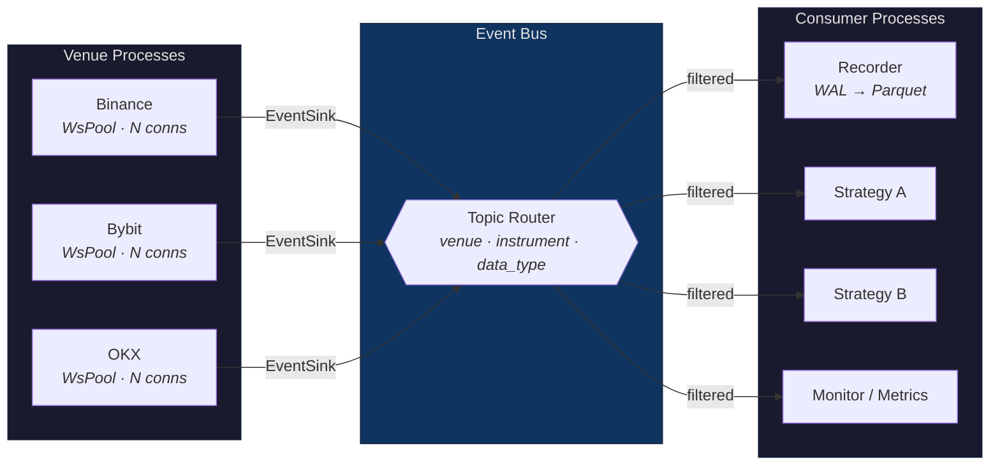
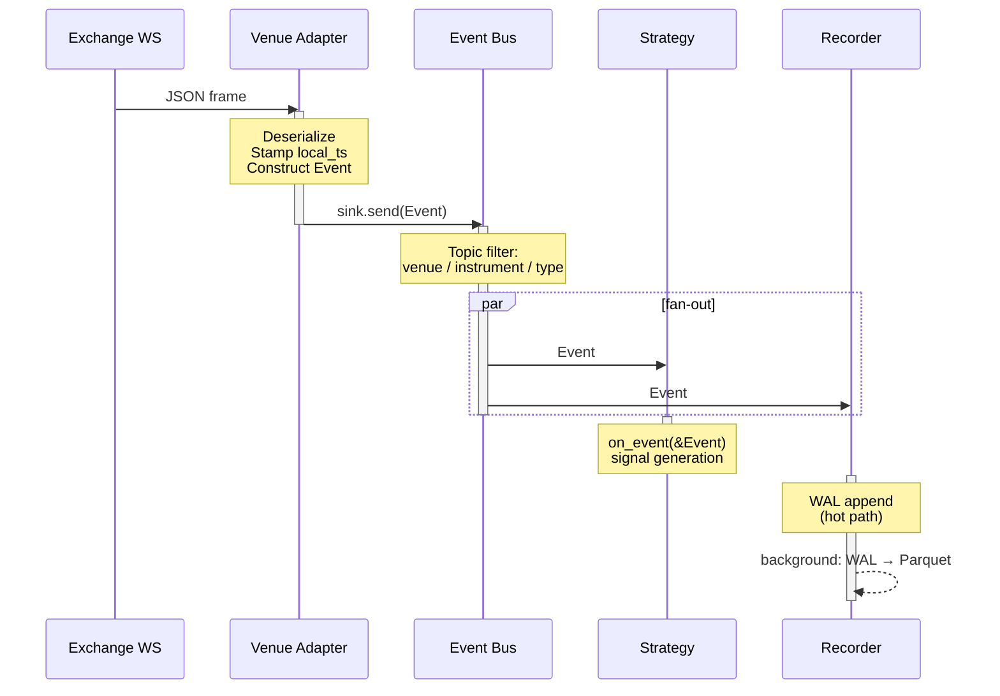
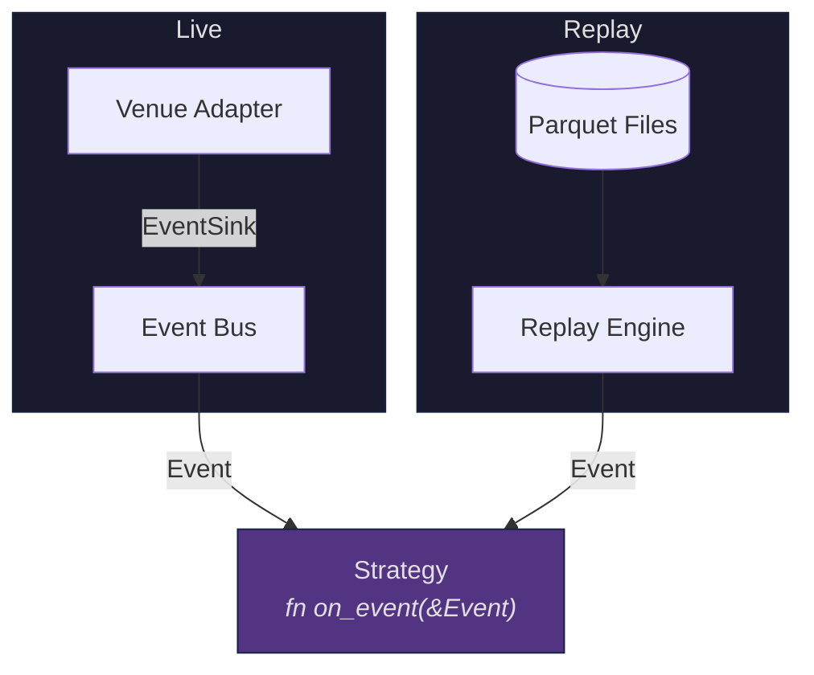
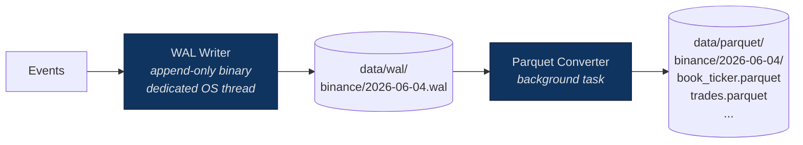
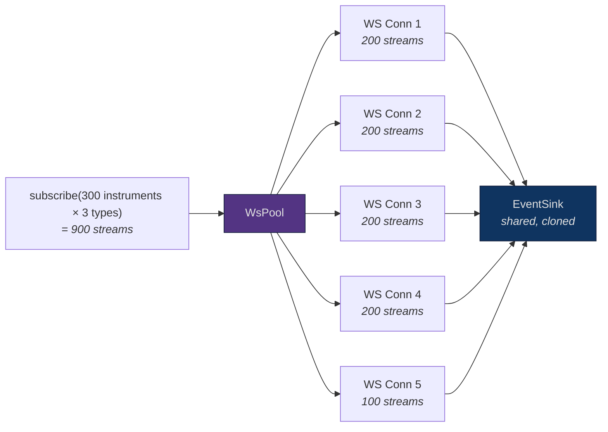
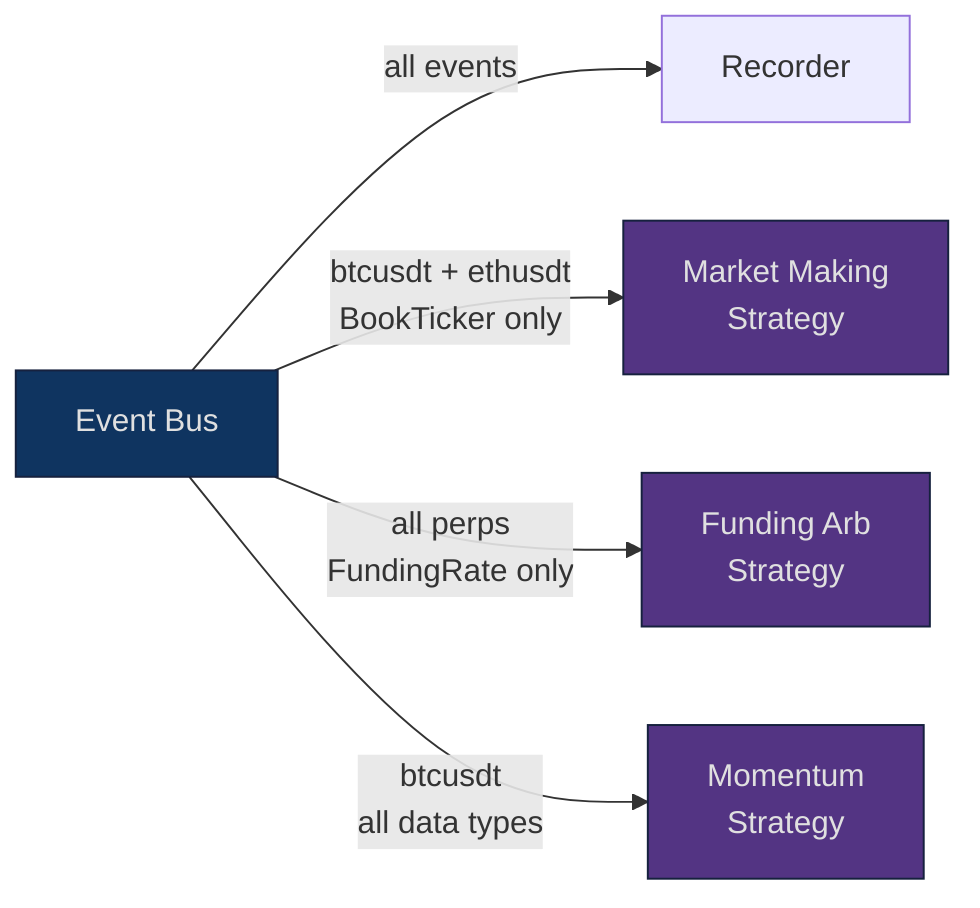

# Trading Data Framework

Event-driven market data infrastructure for collecting, recording, and replaying
data from multiple venues. Built for strategy development and live trading.

## Architecture

### System Overview

Every component communicates through a single abstraction — `EventSink`. Venue
adapters, the event bus, recorder, replay engine, and trading strategies all
produce or consume the same `Event` type. Swapping transport, adding venues, or
plugging in a new strategy requires no changes to existing components.

### Event Flow

A single event traced from exchange WebSocket to strategy and storage:

### Live vs Replay: Same Interface

Strategies implement a single event handler. The framework decides whether events
come from live venues or from recorded Parquet files. The strategy cannot tell
the difference.

### Recording Pipeline

### WebSocket Connection Sharding

Each venue adapter automatically shards subscriptions across multiple WebSocket
connections when the stream count exceeds the exchange's per-connection limit.

### Plugging In a Strategy

A strategy is any consumer that receives events from the bus. Subscribe with a
topic filter to receive only the data you need.

## Crate Map

| Crate | Status | Purpose |
|-------|--------|---------|
| `venue-core` | built | Domain types: `Event`, `Payload`, `Level`, `Trade`, `InstrumentId`, `VenueId`, `Nanos` |
| `venue-adapter` | built | Traits: `VenueAdapter<S: EventSink>`, `EventSink`, `Subscription`, `DataType` |
| `venue-binance` | wip | Binance Futures adapter with WsPool sharding |
| `wire` | planned | Binary event serialization for IPC |
| `transport` | planned | `EventSink` impls: `UdsSink` (Phase 1), `ShmSink` (Phase 2) |
| `event-bus` | planned | Central pub/sub event router with topic filtering |
| `recorder` | planned | WAL hot capture + Parquet conversion |
| `replay` | planned | Parquet reader, emits events through `EventSink` |

## IPC Transport Phases

| Phase | Transport | Latency | Change required |
|-------|-----------|---------|-----------------|
| 1 | Unix Domain Sockets | ~20-55 us end-to-end | — |
| 2 | Shared Memory Ring Buffers | < 10 us end-to-end | swap `EventSink` impl at startup |

No venue, strategy, or consumer code changes between phases. Only the concrete
type passed to `BinanceAdapter::new(sink)` differs.

## See Also

- [docs/architecture.md](docs/architecture.md) — full technical architecture with code examples, wire formats, and latency budgets
