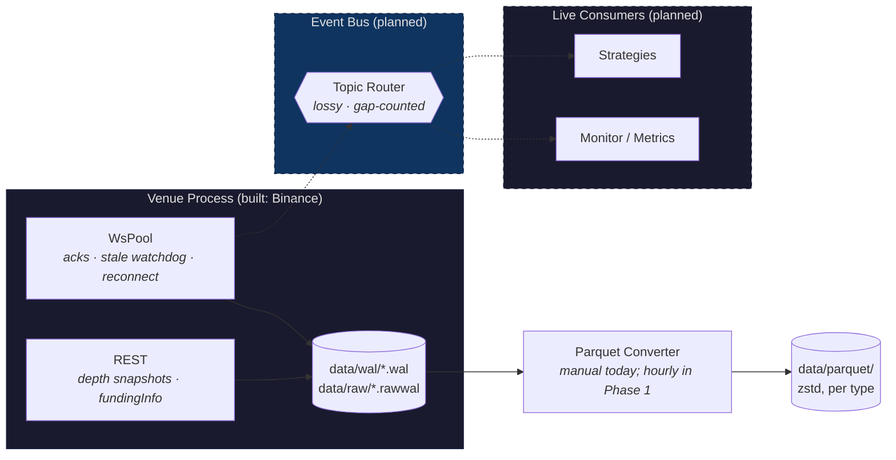
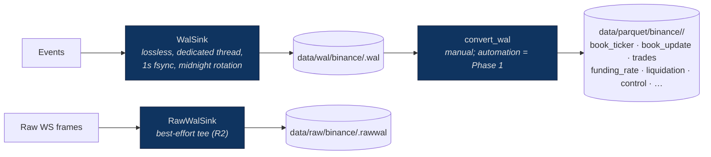

# Trading Data Framework

Event-driven market data infrastructure for collecting, recording, and replaying
data from multiple venues. Built for strategy development and live trading.

**Status (2026-06-10):** single-venue capture is real and hardened — Binance
USD-M futures → framed WAL (+ raw-frame tee) → zstd Parquet, with the wire-v1
schema frozen (see `docs/report-fable-10062026.md` Phase 0). The event bus,
replay, and strategy layers are designed but **not built yet**; diagrams below
mark them *(planned)*.

## Architecture

**Durability lives at the edge**: each venue process writes its own WAL
in-process before anything else sees an event. The future bus serves live
consumers only and is allowed to be lossy (it injects `Gap` control events) —
it is never in the durability path.



### Event envelope (wire v1, frozen)

All components produce or consume one `Event` type:

```rust
Event {
    venue, instrument,
    venue_ts,      // venue transaction time
    local_ts,      // capture-host time (mandatory; replay merge clock)
    source,        // which connection/poller produced it
    provenance,    // reserved for on-chain sources
    payload,       // Market | Reference | Chain | Account | Control
}
```

Market data covers books (ticker / snapshots / diffs with venue update-id
chains), trades (string ids), mark/index, funding (with interval + clamps),
open interest, and liquidations. Control events (`ConnUp/Down`, `SubAck`,
`Gap`, …) are recorded in the WAL like market data, so replay sees the same
discontinuities live consumers saw. The wire format is versioned, CRC-framed,
and self-healing on read; field order is frozen per version
(`docs/architecture.md` §3).

### Live vs Replay: same interface *(replay planned — Phase 4)*

Strategies implement a single event handler; the framework decides whether
events come from live venues or recorded files. Replay sorts (files are
arrival-ordered) and replays control events, so backtests cannot see a fantasy
continuity that live never had.

### Recording pipeline (built)



A WAL I/O error exits the process (a capture process that cannot persist must
die visibly, not look healthy while recording nothing). The raw tee makes
parser defects survivable: re-run normalization instead of losing the day.

### WebSocket connection sharding (built)

`WsPool` shards subscriptions at 200 streams/connection, watches SUBSCRIBE
acks, reconnects with jittered backoff (immediately after stable sessions),
re-snapshots depth on every reconnect, and emits `ConnUp/ConnDown` control
events through the same sink.

## Crate Map

| Crate | Status | Purpose |
|-------|--------|---------|
| `venue-core` | built | Envelope v2, domain payloads, symbology types (`Asset`, `InstrumentClass`, `CanonicalInstrumentId`), `SourceId`, `Provenance`, `RawFrame` |
| `venue-adapter` | built | Traits (RPITIT): `EventSink` (+`send_batch`), `RawFrameSink`, `VenueAdapter<S>`, `Subscription{scope,data}` |
| `venue-binance` | built | Binance USD-M adapter: WsPool, REST snapshot fetcher, fundingInfo, exchangeInfo dump, fixture tests |
| `wire` | built | Framed MessagePack (`magic/version/len/crc32`), self-healing `FrameReader`, golden-bytes layout pin |
| `recorder` | built | `WalWriter`/`WalSink`, `RawWalWriter`, zstd Parquet converter, acceptance checker (`verify_depth`) |
| `config` + `venue-process` | planned (Phase 1) | TOML config + unattended supervised entrypoint |
| `backfill` / `symbology` | planned (Phase 2) | REST history + reconciliation; canonical instrument registry |
| `bus` / `replay` / `strategy` / `execution` | planned (Phases 3–6) | See `docs/report-fable-10062026.md` §7 roadmap |

## Quick start

```bash
cargo run -p venue-binance --example smoke            # live capture → data/wal + data/raw
cargo run -p recorder --example read_wal data/wal/binance/<date>.wal
cargo run -p recorder --example verify_depth data/wal/binance/<date>.wal   # pu-chain/splice gate
cargo run -p recorder --example convert_wal data/wal/binance/<date>.wal data/parquet/binance/<date>
```

## See Also

- [docs/architecture.md](docs/architecture.md) — contracts: schema freeze rules, timestamp semantics, reader recovery, converter schemas
- [docs/report-fable-10062026.md](docs/report-fable-10062026.md) — target architecture and phased roadmap (R1–R12)
- [docs/improvement_plan.md](docs/improvement_plan.md) — the implemented Phase-0 remediation, with as-built amendments
